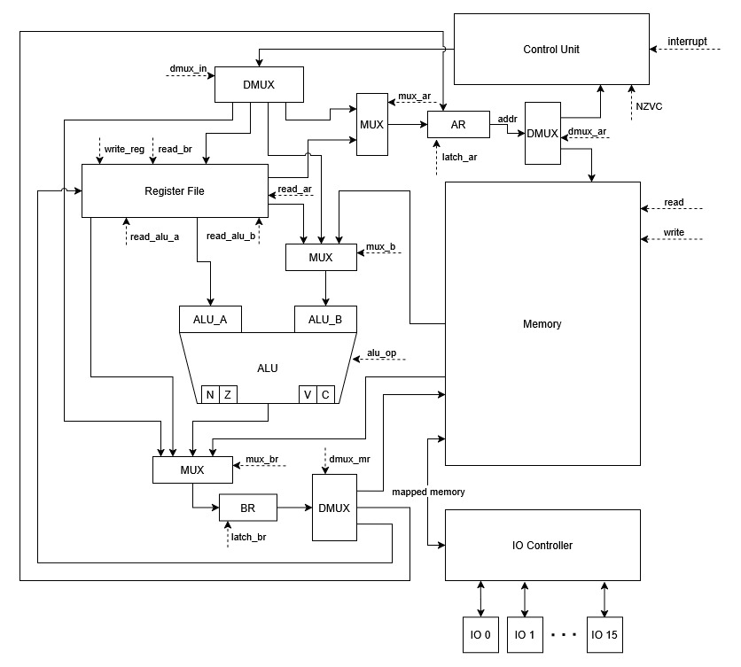
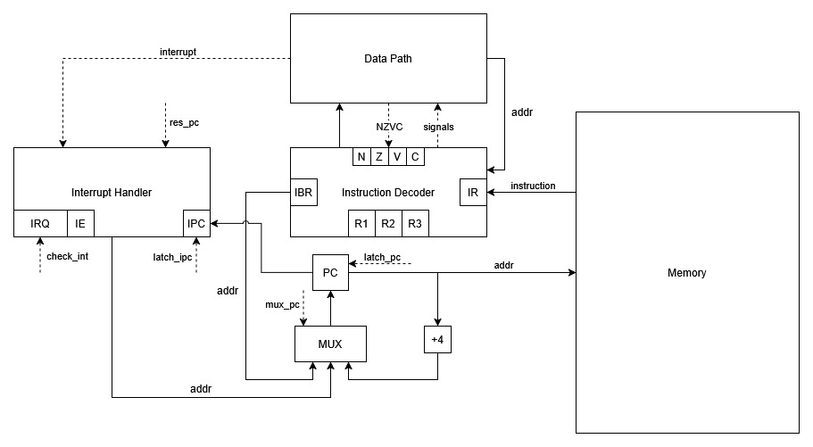

# Лабораторная работа 4
Выполнил: `Пышкин Никита Сергеевич, P3213`<br>
Вариант: `alg | risc | neum | hw | tick | binary | trap | mem | cstr | prob2 | cache`

# Язык программирования
## Описание синтаксиса (Форма Бэкуса-Наура)
```
<программа> ::= <операция> | <операция> <пробельная последовательность> <программа>

<операция> ::= <объявление функции>
    | <вызов функции>
    | <цикл for> 
    | <условный оператор if> 
    | <операция присвоения> 
    | <операция инициализации>

<пробельная последовательность> ::= (<пробел> | <комментарий>) (<пробельная последовательность> | <пусто>)
<комментарий> ::= "#" <последовательность символов> "\n"

<объявление функции> ::= (<тип данных> | "void") <пробельная последовательность> <переменная> "(" (<список аргументов> | <пусто>) ")" "{" 
    (<программа> | <программа> <выход из функции> (<пробельная последовательность> <набор базовых элементов> | <пусто>) ";")
"}"

<список аргументов> ::= <аргумент> | <аргумент> "," <список аргументов>
<аргумент> ::= <переменная> ":" <тип данных>

<вызов функции> ::= <переменная> "(" <набор базовых элементов> ")" ";"
<выход из функции> ::= "return"

<цикл for> ::= "for" "[" 
    (<операция инициализации> | <операция присвоения> | <пусто>) ";" 
    (<булево выражение> | <пусто>) ";"
    (<операция присвоения> | <пусто>) 
"]" "{" <тело цикла> "}"

<тело цикла> ::= <операции в цикле> | <тело цикла> <операции в цикле>
<операции в цикле> ::= <программа> | <манипуляции циклом>
<манипуляции циклом> ::= "break" ";" | "continue" ";"

<условный оператор if> ::= "if" "[" <булево выражение> "]" "{" <программа> "}"

<операция инициализации> ::= <переменная> ":" <тип данных> "=" (<выражение> | <операция ввода>) ";"
<операция присвоения> ::= <переменная> "=" (<выражение> | <операция ввода>) ";"

<операция ввода> ::= "input" "(" (<число> | <пусто>) ")"
<операция вывода> ::= "print" "(" (<набор базовых элементов> | <пусто>) ")"

<тип данных> ::= "int" | "str"

<булево выражение> ::= <булево OR>
<булево OR> ::= <булево AND> | <булево OR> "or" <булево AND>
<булево AND> ::= <булево NOT> | <булево AND> "and" <булево NOT>
<булево NOT> ::= <булева единица> | "not" <булево NOT>
<булева единица> ::= "(" <булево выражение> ")" | <выражение> <операция сравнения> <выражение> 

<выражение> ::= <слагаемое> | <слагаемое> ("+" | "-") <слагаемое> 
<слагаемое> ::= <множитель> | <множитель> ("*" | "/" | "%") <множитель>
<множитель> ::= <базовый элемент> | "(" <выражение> ")"

<операция сравнения> ::= "==" | "<" | "<=" | ">" | ">=" | "!="

<число> ::= <последовательность цифр> 
    | "-" <последовательность цифр>
    | <число> <операция побитового сдвига> <число>

<последовательность цифр> ::= <цифра> | <цифра> <последовательность цифр>

<операция побитового сдвига> ::= "<<" | ">>"

<строка> ::= '"' (<последовательность символов> | <пусто>) '"'
<последовательность символов> ::= <символ> | <символ> <последовательность символов>
<символ> ::= <цифра> | <буква> | <пробел> | "_"

<переменная> ::= (<буква> | "_") | (<буква> | "_") <название переменной>
<название переменной> ::= <символ переменной> | <символ переменной> <название переменной> 
<символ переменной> ::= <цифра> | <буква> | "_"

<набор базовых элементов> ::= <базовый элемент> | <базовый элемент> "," <набор базовых элементов>
<базовый элемент> ::= <переменная> | <число> | <строка> | <вызов функции>

<пусто> ::= ε
<пробел> ::= "\n" | "\t" | " "
<цифра> ::= "0" | "1" | "2" | "3" | "4" | "5" | "6" | "7" | "8" | "9"
<буква> ::= "A" | "B" | "C" | "D" | "E" | "F" | "G" | "H" | "I" | "J" 
    | "K" | "L" | "M" | "N" | "O" | "P" | "Q" | "R" | "S" | "T" | "U" 
    | "V" | "W" | "X" | "Y" | "Z" | "a" | "b" | "c" | "d" | "e" | "f" 
    | "g" | "h" | "i" | "j" | "k" | "l" | "m" | "n" | "o" | "p" | "q" 
    | "r" | "s" | "t" | "u" | "v" | "w" | "x" | "y" | "z" 
```

## Описание семантики

### Стратегия вычислений
Аргументы функции вычисляются до вызова функции, слева-направо. Вычисленное значение копируется в новую область памяти, выделенную специально для аргументов функции.

### Область видимости
Область видимости переменных ограничена фигурными скобками, в которых она была объявлена (если переменная объявлена вне скобок, то она находится в глобальной области видимости). За пределами этих фигурных скобок переменная не видна. Переменная может быть успешно изменена в новом уровне вложенности, без создания новой. Переменные с одинаковым именем не могут быть объявлены на одном и том же уровне видимости, но могут быть объявлены на разных (даже если один уровень видимости является вложением для другого).
```
number:int = 3
if [number < 5] {
    number = number + 1;
}
print(number);  # 4
```
```
number:int = 3
if [number < 5] {
    number:int = 4
    number = number + 1;
    print(number);  # 5
}
print(number);  # 3
```
Для функций работают те же правила области видимости, что и для переменных.
```
void do_something() {
    do_print();

    void do_print() {
        print(52);
    }
}

do_something();  # 52
do_print();  # Ошибка
```

### Типизация. Виды литералов
Типизация сильная и строгая. При этом есть следующие типы данных:
 - `str` - строковый тип данных, текст пишется в двойных кавычках.
 - `int` - численный тип данных, используется только для целых чисел.

Булевый тип данных отсутствует, вместо него следует использовать `int`.

# Организация памяти

## Машинное слово
В данной лабораторной работе используется фон Неймовская 32-битная архитектура (соответственно, ширина машинного слова - 32 бита). Порядок байтов в машинном слове - little-endian.

## Регистры
Модель процессора включает себя следующий набор служебных регистров (защелок), недоступных для изменения программистом:
 - `PC` - 32-битный регистр, который хранит адрес следующей инструкции.
 - `IRQ` - 17-битный регистр, который хранит флаг `IE` (разрешение прерываний) и по одному бит для каждого из источника прерываний.
 - `IR`, `AR`, `BR`, `IPC`, `IBR` - 32-битные регистры для сохранения инструкций, адреса, счетчика значений (в прерываниях) и промежуточных значений.
 - `R1`, `R2`, `R3` - 5-битные регистры, хранящие идентификаторы регистров общего назначения.
 - `ALU_A`, `ALU_B` - 32-битные входы АЛУ (левый и правый соответственно)
 - `NZVC` - 4-битный регистр, хранящий флаги результатов операции АЛУ.

Помимо служебных, процессор включает в себя 32 регистра, доступных программисту: `S1`, `S2`, `S3`, `S4`, `S5`, `S6`, `S7`, `S8`, `S9`, `S10`, `S11`, `S12`, `S13`, `S14`, `S15`, `S16`, `T1`, `T2`, `T3`, `T4`, `T5`, `T6`, `A1`, `A2`, `A3`, `A4`, `A5`, `A6`, `A7`, `A8`, `Ra`, `Sp`.<br>

Назначение регистров:
 - `Sp` - адрес верхушки стека
 - `Ra` - адрес возврата из функции
 - `A1`-`A8` - аргументы и возвращаемое значение функции, если регистров не хватает, используется стек
 - `T1`-`T6` - регистры общего назначения, должны сохраняться вызывающей стороной (caller-saved регистры)
 - `S1`-`S15` - регистры общего назначения, должны сохраняться вызванной стороной (callee-saved регистры)

Примечание: ответственность за обработку регистров `Sp` и `Ra` полностью лежит на плечах программиста, никакая из команд не изменяет значения этих переменных по умолчанию.

## Варианты адресации
В кодируемых командах длина КОП = 9 бит (3 из которых заняты под вид адресации), длина идентификатора регистра = 5 бит.

|                   Адресация                   | Кодировка адресации |
|-----------------------------------------------|:-------------------:|
| Абсолютная адресация                          |        `000`        |
| Адресно-косвенная адресация                   |        `001`        |
| Регистрово-косвенная адресация со смещением   |        `010`        |
| Безадресная адресация (без регистров)         |        `011`        |
| Безадресная адресация (1 регистр)             |        `100`        |
| Безадресная адресация (2 регистра)            |        `101`        |
| Прямая загрузка                               |        `110`        |

### Абсолютная адресация
Абсолютная адресация применяется в следующих ситуациях:
 - Загрузки в регистр значения из ячейки по абсолютному адресу.
 - Сохранение значения из регистра в ячейку по абсолютному адресу.

```
31                                          14          9                   0
+-------------------------------------------+-----------+-------------------+
|                   АДРЕС                   |  РЕГИСТР  |        КОП        |
+-------------------------------------------+-----------+-------------------+
```

Так как в данном варианте адрес занимает 18 бит, максимальное значение, которое можно загрузить таким образом: `0X3FFFF` (что соответствует `2^18 - 1` в десятичной системе счисления).

### Адресно-косвенная адресация
Косвенная адресация применяется в следующих ситуациях:
 - Загрузка в регистр значения из ячейки, адрес которой лежит в ячейке по указанному в команде адресу.
 - Сохранение значения из регистра в ячейку, адрес которой лежит в ячейке по указанному в команде адресу.

```
31                                          14          9                   0
+-------------------------------------------+-----------+-------------------+
|                   АДРЕС                   |  РЕГИСТР  |        КОП        |
+-------------------------------------------+-----------+-------------------+
```

Кодирование этой адресации схоже со случаем кодирования абсолютной адресации.

### Регистрово-косвенная адресация со смещением
Регистрово-косвенная адресация со смещением применяется в следующих ситуациях:
 - Загрузка в регистр значения по адресу (с заданным смещением), который лежит в другом регистре.
 - Сохранение значения из регистра по адресу (с заданным смещением), который лежит в другом регистре.

```
31                               19          14          9                   0
+--------------------------------+-----------+-----------+-------------------+
|            СМЕЩЕНИЕ            |  РЕГИСТР  |  РЕГИСТР  |        КОП        |
+--------------------------------+-----------+-----------+-------------------+
```

Смещение занимает 13 бит, максимальное значение смещения, которое можно задать таким образом: `0X1FFF` (что соответствует `2^13 - 1` в десятичной системе счисления).

### Безадресная адресация
Адресация, которая используется в большинстве команд для данной архитектуры. Она работает только с регистрами, без обращения к памяти. Сюда входят: арифметические операции, побитовые операции и операции управления потоком исполнения. Также стоит обратить внимание на разные виды кодировки, т.к. разные варианты используют разное количество регистров.<br>

Арифметические и побитовые операции:
```
31                              19          14          9                   0
+-------------------------------+-----------+-----------+-------------------+
| 0 0 0 0 0 0 0 0 0 0 0 0 0 0 0 |  РЕГИСТР  |  РЕГИСТР  |        КОП        |
+-------------------------------+-----------+-----------+-------------------+
```
```
31                  24          19          14          9                   0
+-------------------+-----------+-----------+-----------+-------------------+
| 0 0 0 0 0 0 0 0 0 |  РЕГИСТР  |  РЕГИСТР  |  РЕГИСТР  |        КОП        |
+-------------------+-----------+-----------+-----------+-------------------+
```

Операции ветвления:
```
31                                                      9                   0
+-------------------------------------------------------+-------------------+
|                          АДРЕС                        |        КОП        |
+-------------------------------------------------------+-------------------+
```
```
31                              19          14          9                   0
+-------------------------------+-----------+-----------+-------------------+
| 0 0 0 0 0 0 0 0 0 0 0 0 0 0 0 |  РЕГИСТР  |  РЕГИСТР  |        КОП        |
+-------------------------------+-----------+-----------+-------------------+
```
```
31                                          14          9                   0
+-------------------------------------------+-----------+-------------------+
| 0 0 0 0 0 0 0 0 0 0 0 0 0 0 0 0 0 0 0 0 0 |  РЕГИСТР  |        КОП        |
+-------------------------------------------+-----------+-------------------+
```

Инструкции без операндов:
```
31                                                      9                   0
+-------------------------------------------------------+-------------------+
| 0 0 0 0 0 0 0 0 0 0 0 0 0 0 0 0 0 0 0 0 0 0 0 0 0 0 0 |        КОП        |
+-------------------------------------------------------+-------------------+
```

### Прямая загрузка
Прямая загрузка нужна для загрузки литерала в регистр.
```
31                                         14          9                   0
+------------------------------------------+-----------+-------------------+
|                 ЗНАЧЕНИЕ                 |  РЕГИСТР  |        КОП        |
+------------------------------------------+-----------+-------------------+
```

## Расположение данных в памяти
Как уже было сказано ранее, процессор использует концепцию фон Неймана, поэтому все инструкции, данные, процедуры и т.д. находятся на одной ленте памяти. При этом, расположены в памяти они следующим образом:
```     
+--------------------------------------------------+
|                Вектора прерываний                |
+--------------------------------------------------+
| 00  : вектор прерывания 1                        |
| 01  : вектор прерывания 2                        |
|    ...                                           |
| 0F  : вектор прерывания 16                       |
+--------------------------------------------------+
|                Порты ввода-вывода                |
+--------------------------------------------------+
| 10  : порт ввода                                 |
| 11  : порт вывода                                |
+--------------------------------------------------+
|               Константы (c - метка)              |
+--------------------------------------------------+
| c+0 : константные данные 1                       |
| c+1 : константные данные 2                       |
|    ...                                           |
| c+N : константные данные N                       |
+--------------------------------------------------+
|              Переменные (d - метка)              |
+--------------------------------------------------+
| d+0 : переменная 1                               |
| d+1 : переменная 2                               |
|    ...                                           |
| d+N : переменная N                               |
+--------------------------------------------------+
|          Основная программа (p - метка)          |
+--------------------------------------------------+
| p+0 : инструкция 1                               |
| p+1 : инструкция 2                               |
|    ...                                           |
| p+N : инструкция N                               |
+--------------------------------------------------+
|  Процедуры и обработчики прерываний (f - метка)  |
+--------------------------------------------------+
| f+0 : процедура/обработчик 1                     |
|    ...                                           |
| f+N : процедура/обработчик N                     |
+--------------------------------------------------+
|                       Стек                       |
+--------------------------------------------------+
| ??? : конец стека                                |
|    ...                                           |
| MAX : начало стека                               |
+--------------------------------------------------+
```

### Вектора прерываний
Всего доступно 16 векторов прерываний (из них используется не все, большая часть - резерв), которые расположены в самом начале памяти. По этим адресам находятся адреса обработчиков прерываний (чем меньше адрес, тем больше приоритет у прерывания). Если прерывание не обрабатывается, то нужно все равно оставить обработчик-заглушку (обработчик, который будет ничего не делать и возвращать программу в обычный поток выполнения).<br><br>
Обработка прерывания является аппаратно-программной: служебные регистры сохраняются системой в теневые регистры, все остальные регистры (если они требуются) должны быть сохранены программистом. Во время обработки одного прерывания, система блокирует выполнение других прерываний, в том числе и от одного и того же устройства (поэтому обработчики прерываний должны быть как можно более компактными, чтобы не потерять данные). Для выхода из обработчика прерывания используется специальная команда, которая вернет систему в состояние до прерывания и установит флаг IE в 1.

### Порты ввода-вывода
Порты ввода и вывода мапятся на адреса памяти. Конфигурация процессора по умолчанию делает это на адреса, которые находятся сразу же за портами ввода и вывода.

### Константы
Константные значения идут после портов ввода-вывода. Все константы располагаются вплотную друг к другу (а если точнее, вплотную располагаются машинные слова с константами). Является ли переменная константой - определяет компилятор или программист.

### Переменные
Переменные идут после констант. Если переменная является числом (или любым другим типом данных, для хранения которого нужно фиксированное количество машинных слов), то она располагается вплотную к следующей за ней переменной. Иначе, нужное место для переменной вычисляется компилятором.<br><br>
Стоит отметить, что численные переменные (или любые другие, если они помещаются в одно машинное слово) отображаются в регистры общего назначения. Только если регистров не хватает, переменная отображается в память.

### Основная программа
Основная программа находится после переменных. Ее точное положение определяется компилятором.

### Процедуры и обработчики прерываний
Процедуры и обработчики прерываний (которые по своей сути тоже являются процедурами), находятся сразу же за основной программой. Важно не забывать, что ответственность за поток выполнения программы лежит на программисте.

### Стек
В данной модели памяти стек не является аппаратной частью и реализуется полностью программно. Компилятор располагает его в самом конце памяти (с оглядкой на доступность через косвенную адресацию) и растит его вниз.

# Система команд

## Описание команд
Условные обозначения: `-` - операция не влияет на флаг, `*` - флаг выставляется по результату операции, `0` - операция сбрасывает флаг.

<!--
    TODO: mov не очень подходящее название, заменить
-->
### Перемещение данных
|        синтаксис        | кол-во тактов |              краткое описание              |      NZVC      |
|-------------------------|:-------------:|--------------------------------------------|:--------------:|
| `lui <r1> <value>`      |      `4`      | `<r1> <- <value> & 0xFF00`                 |     `----`     |
| `lli <r1> <value>`      |      `4`      | `<r1> <- <value> & 0x00FF`                 |     `----`     |
| `lw <r1> <addr>`        |      `4`      | `<r1> <- mem[<addr>]`                      |     `----`     |
| `sw <addr> <r1>`        |      `4`      | `mem[<addr>] <- <r1>`                      |     `----`     |
| `mov <r1> <r2>(k)`      |      `5`      | `<r1> <- mem[<r2> + k]`                    |     `----`     |

### Арифметические операции
|        синтаксис        | кол-во тактов |              краткое описание              |      NZVC      |
|-------------------------|:-------------:|--------------------------------------------|:--------------:|
| `add <r1> <r2> <r3>`    |      `4`      | `<r1> <- <r2> + <r3>`                      |     `****`     |
| `sub <r1> <r2> <r3>`    |      `4`      | `<r1> <- <r2> - <r3>`                      |     `****`     |
| `mul <r1> <r2> <r3>`    |      `4`      | `<r1> <- <r2> * <r3>`                      |     `****`     |
| `div <r1> <r2> <r3>`    |      `4`      | `<r1> <- <r2> / <r3>`                      |     `***0`     |
| `rem <r1> <r2> <r3>`    |      `4`      | `<r1> <- <r2> % <r3>`                      |     `**00`     |

### Битовые операции
|        синтаксис        | кол-во тактов |              краткое описание              |      NZVC      |
|-------------------------|:-------------:|--------------------------------------------|:--------------:|
| `and <r1> <r2> <r3>`    |      `4`      | `<r1> <- <r2> & <r3>`                      |     `**0-`     |
| `or <r1> <r2> <r3>`     |      `4`      | `<r1> <- <r2> \| <r3>`                     |     `**0-`     |
| `xor <r1> <r2> <r3>`    |      `4`      | `<r1> <- <r2> ^ <r3>`                      |     `**0-`     |
| `not <r1> <r2>`         |      `4`      | `<r1> <- ~<r2>`                            |     `**0-`     |
| `shl <r1> <r2> <r3>`    |      `4`      | `<r1> <- <r2> << <r3>`                     |     `**0*`     |
| `shr <r1> <r2> <r3>`    |      `4`      | `<r1> <- <r2> >> <r3>`                     |     `**0-`     |

### Управление потоком исполнения
|        синтаксис        | кол-во тактов |                   краткое описание                   |      NZVC      |
|-------------------------|:-------------:|------------------------------------------------------|:--------------:|
| `jr <r1>`               |      `3`      | `pc <- <r1>`                                         |     `----`     |
| `cmp <r1> <r2>`         |      `3`      | `NZVC <- <r1> - <r2>`                                |     `****`     |
| `beq <addr>`            |      `2`      | `if Z = 1 then pc <- <addr>`                         |     `----`     |
| `bne <addr>`            |      `2`      | `if Z = 0 then pc <- <addr>`                         |     `----`     |
| `bge <addr>`            |      `2`      | `if N = V then pc <- <addr>`                         |     `----`     |
| `ble <addr>`            |      `2`      | `if N != V or Z = 1 then pc <- pc <- <addr>`         |     `----`     |
| `bsg <addr>`            |      `2`      | `if Z = 0 and N = V then pc <- pc <- <addr>`         |     `----`     |
| `bsl <addr>`            |      `2`      | `if N != V then pc <- <addr>`                        |     `----`     |
| `reti`                  |      `2`      | `IE = 0`, `<system registers> <- <shadow registers>` |     `****`     |
| `halt`                  |      `2`      | `stop the machine`                                   |     `****`     |

## Потактовое выполнение команд
Этапы выполнения команды:
 - Цикл выборки команды (IF)
 - Цикл декодирования команды (ID)
 - Цикл исполнения команды (EX)
 - Цикл обращения к памяти (MEM)
 - Цикл записи результата (WB)
 - Цикл обработки прерывания (INT)

Цикл обработки прерывания происходит параллельно со стадией `IF` у каждой команды. Происходит это следующим образом: на фронте такта `PC` отправляет свое значение в `IPC` и отправляет запрос в память на получение инструкции. На спаде такта, после получения инструкции в Instruction Decoder, отправляется сигнал в Interrupt Handler для проверки того, есть ли там прерывание (`IE` равен 1). Если прерывание есть, выполнение текущей команды останавливается и в `PC` записывается один из векторов прерываний (который выше по приоритету), значение `IRQ` при этом тоже изменяется. После записи в `PC` вектора прерывания мы попадаем в обработчик прерывания, из которого потом выходим командой `iret`.<br>

Допущения: процессор оптимизирован для загрузки значений сразу из двух регистров в АЛУ

### Перемещение данных

#### LUI (Load Upper Immediate): `lui <r1> <value>`
| Такт |  Стадия  |               Действие               |
|:----:|:--------:|--------------------------------------|
| `1`  |   `IF`   | `IR <- [PC], PC <- PC + 4`           |
| `2`  |   `ID`   | `R1 <- IR[9:13], ALU_B <- IR[14:31]` |
| `3`  |   `EX`   | `BR <- ALU_B & 0xFF00`               |
| `4`  |   `WB`   | `[R1] <- BR`                         |

#### LLI (Load Lower Immediate): `lli <r1> <value>`
| Такт |  Стадия  |              Действие                |
|:----:|:--------:|--------------------------------------|
| `1`  |   `IF`   | `IR <- [PC], PC <- PC + 4`           |
| `2`  |   `ID`   | `R1 <- IR[9:13], ALU_B <- IR[14:31]` |
| `3`  |   `EX`   | `BR <- ALU_B & 0x00FF`               |
| `4`  |   `WB`   | `[R1] <- BR`                         |

#### LW (Load Word): `lw <r1> <addr>`
| Такт |  Стадия  |              Действие              |
|:----:|:--------:|------------------------------------|
| `1`  |   `IF`   | `IR <- [PC], PC <- PC + 4`         |
| `2`  |   `ID`   | `R1 <- IR[9:13], AR <- IR[14:31]`  |
| `3`  |   `MEM`  | `BR <- mem[AR]`                    |
| `4`  |   `WB`   | `[R1] <- BR`                       |

#### SW (Save Word): `sw <addr> <r1>`
| Такт |  Стадия  |                     Действие                     |
|:----:|:--------:|--------------------------------------------------|
| `1`  |   `IF`   | `IR <- [PC], PC <- PC + 4`                       |
| `2`  |   `ID`   | `R1 <- IR[9:13], AR <- IR[14:31]; BR <- mem[R1]` |
| `4`  |   `MEM`  | `[AR] <- BR`                                     |

#### MOV (Move): `mov <r1> <r2>(k)`
| Такт |  Стадия  |                    Действие                    |
|:----:|:--------:|------------------------------------------------|
| `1`  |   `IF`   | `IR <- [PC], PC <- PC + 4`                     |
| `2`  |   `ID`   | `R1 <- IR[9:13], R2 <- IR[14:18]; ALU_B <- k`  |
| `3`  |   `EX`   | `ALU_A <- [R2]; AR <- BR`                      |
| `4`  |   `MEM`  | `BR <- [AR]`                                   |
| `5`  |   `WB`   | `[R1] <- BR`                                   | 

### Арифметические операции

#### ADD (Signed Addition): `add <r1> <r2> <r3>`
| Такт |  Стадия  |                              Действие                              |
|:----:|:--------:|--------------------------------------------------------------------|
| `1`  |   `IF`   | `IR <- [PC], PC <- PC + 4`                                         |
| `2`  |   `ID`   | `R1 <- IR[9:13], R2 <- IR[14:18], R3 <- IR[19:23]`                 |
| `3`  |   `EX`   | `ALU_A <- [R2], ALU_B <- [R3]; BR, NZVC <- ALU_A + ALU_B`          | 
| `4`  |   `WB`   | `[R1] <- BR`                                                       |

#### SUB (Signed Subtraction): `sub <r1> <r2> <r3>`
| Такт |  Стадия  |                              Действие                              |
|:----:|:--------:|--------------------------------------------------------------------|
| `1`  |   `IF`   | `IR <- [PC], PC <- PC + 4`                                         |
| `2`  |   `ID`   | `R1 <- IR[9:13], R2 <- IR[14:18], R3 <- IR[19:23]`                 |
| `3`  |   `EX`   | `ALU_A <- [R2], ALU_B <- [R3]; BR, NZVC <- ALU_A - ALU_B`          |
| `4`  |   `WB`   | `[R1] <- BR`                                                       |

#### MUL (Signed Multiply): `mul <r1> <r2> <r3>`
| Такт |  Стадия  |                              Действие                              |
|:----:|:--------:|--------------------------------------------------------------------|
| `1`  |   `IF`   | `IR <- [PC], PC <- PC + 4`                                         |
| `2`  |   `ID`   | `R1 <- IR[9:13], R2 <- IR[14:18], R3 <- IR[19:23]`                 |
| `3`  |   `EX`   | `ALU_A <- [R2], ALU_B <- [R3]; BR, NZVC <- ALU_A * ALU_B`          |
| `4`  |   `WB`   | `[R1] <- BR`                                                       |

#### DIV (Signed Division): `div <r1> <r2> <r3>`
| Такт |  Стадия  |                              Действие                              |
|:----:|:--------:|--------------------------------------------------------------------|
| `1`  |   `IF`   | `IR <- [PC], PC <- PC + 4`                                         |
| `2`  |   `ID`   | `R1 <- IR[9:13], R2 <- IR[14:18], R3 <- IR[19:23]`                 |
| `3`  |   `EX`   | `ALU_A <- [R2], ALU_B <- [R3]; BR, NZVC <- ALU_A / ALU_B`          |
| `4`  |   `WB`   | `[R1] <- BR`                                                       |

#### REM (Signed Remainder): `rem <r1> <r2> <r3>`
| Такт |  Стадия  |                              Действие                              |
|:----:|:--------:|--------------------------------------------------------------------|
| `1`  |   `IF`   | `IR <- [PC], PC <- PC + 4`                                         |
| `2`  |   `ID`   | `R1 <- IR[9:13], R2 <- IR[14:18], R3 <- IR[19:23]`                 |
| `3`  |   `EX`   | `ALU_A <- [R2], ALU_B <- [R3]; BR, NZVC <- ALU_A % ALU_B`          |
| `4`  |   `WB`   | `[R1] <- BR`                                                       |

### Битовые операции

#### AND (Logical And): `and <r1> <r2> <r3>`
| Такт |  Стадия  |                              Действие                              |
|:----:|:--------:|--------------------------------------------------------------------|
| `1`  |   `IF`   | `IR <- [PC], PC <- PC + 4`                                         |
| `2`  |   `ID`   | `R1 <- IR[9:13], R2 <- IR[14:18], R3 <- IR[19:23]`                 |
| `3`  |   `EX`   | `ALU_A <- [R2], ALU_B <- [R3]; BR, NZV <- ALU_A & ALU_B`           |
| `4`  |   `WB`   | `[R1] <- BR`                                                       |

#### OR (Logical Or): `or <r1> <r2> <r3>`
| Такт |  Стадия  |                              Действие                              |
|:----:|:--------:|--------------------------------------------------------------------|
| `1`  |   `IF`   | `IR <- [PC], PC <- PC + 4`                                         |
| `2`  |   `ID`   | `R1 <- IR[9:13], R2 <- IR[14:18], R3 <- IR[19:23]`                 |
| `3`  |   `EX`   | `ALU_A <- [R2], ALU_B <- [R3]; BR, NZV <- ALU_A \| ALU_B`          |
| `4`  |   `WB`   | `[R1] <- BR`                                                       |

#### XOR (Logical Xor): `xor <r1> <r2> <r3>`
| Такт |  Стадия  |                              Действие                              |
|:----:|:--------:|--------------------------------------------------------------------|
| `1`  |   `IF`   | `IR <- [PC], PC <- PC + 4`                                         |
| `2`  |   `ID`   | `R1 <- IR[9:13], R2 <- IR[14:18], R3 <- IR[19:23]`                 |
| `3`  |   `EX`   | `ALU_A <- [R2], ALU_B <- [R3]; BR, NZV <- ALU_A ^ ALU_B`           |
| `4`  |   `WB`   | `[R1] <- BR`                                                       |

#### NOT (Logical Not): `not <r1> <r2>`
| Такт |  Стадия  |                Действие                |
|:----:|:--------:|----------------------------------------|
| `1`  |   `IF`   | `IR <- [PC], PC <- PC + 4`             |
| `2`  |   `ID`   | `R1 <- IR[9:13], R2 <- IR[14:18]`      |
| `3`  |   `EX`   | `ALU_A <- [R2]; BR, NZV <- ~ALU_A`     |
| `4`  |   `WB`   | `[R1] <- BR`                           |

#### SHL (Arithmetic Shift Left): `shl <r1> <r2> <r3>`
| Такт |  Стадия  |                              Действие                              |
|:----:|:--------:|--------------------------------------------------------------------|
| `1`  |   `IF`   | `IR <- [PC], PC <- PC + 4`                                         |
| `2`  |   `ID`   | `R1 <- IR[9:13], R2 <- IR[14:18], R3 <- IR[19:23]`                 |
| `3`  |   `EX`   | `ALU_A <- [R2], ALU_B <- [R3]; BR, NZVC <- ALU_A << ALU_B`         |
| `4`  |   `WB`   | `[R1] <- BR`                                                       |

#### SHR (Arithmetic Shift Right): `shr <r1> <r2> <r3>`
| Такт |  Стадия  |                              Действие                              |
|:----:|:--------:|--------------------------------------------------------------------|
| `1`  |   `IF`   | `IR <- [PC], PC <- PC + 4`                                         |
| `2`  |   `ID`   | `R1 <- IR[9:13], R2 <- IR[14:18], R3 <- IR[19:23]`                 |
| `3`  |   `EX`   | `ALU_A <- [R2], ALU_B <- [R3]; BR, NZV <- ALU_A >> ALU_B`          |
| `4`  |   `WB`   | `[R1] <- BR`                                                       |

### Управление потоком исполнения

#### CMP (Compare): `cmp <r1> <r2>`
| Такт |  Стадия  |                        Действие                        |
|:----:|:--------:|--------------------------------------------------------|
| `1`  |   `IF`   | `IR <- [PC], PC <- PC + 4`                             |
| `2`  |   `ID`   | `R1 <- IR[9:13], R2 <- IR[14:18]`                      |
| `3`  |   `EX`   | `ALU_A <- [R2], ALU_B <- [R3]; NZVС <- ALU_A - ALU_B`  |

#### JR (Jump Register): `jr <r1>`
| Такт |  Стадия  |                    Действие                    |
|:----:|:--------:|------------------------------------------------|
| `1`  |   `IF`   | `IR <- [PC]`                                   |
| `2`  |   `ID`   | `R1 <- IR[9:13]`                               | 
| `3`  |   `EX`   | `AR <- [R1], IBR <- AR, PC <- IBR`             |

#### BEQ (Branch Equal): `beq <addr>`
| Такт |  Стадия  |                    Действие                    |
|:----:|:--------:|------------------------------------------------|
| `1`  |   `IF`   | `IR <- [PC], PC <- PC + 4`                     |
| `2`  |   `ID`   | `IBR <- IR[9:31]; if Z = 1 then PC <- IBR`     |

#### BNE (Branch Not Equal): `bne <addr>`
| Такт |  Стадия  |                    Действие                    |
|:----:|:--------:|------------------------------------------------|
| `1`  |   `IF`   | `IR <- [PC], PC <- PC + 4`                     |
| `2`  |   `ID`   | `IBR <- IR[9:31]; if Z = 0 then PC <- IBR`     |

#### BGE (Branch Greater or Equal): `bge <addr>`
| Такт |  Стадия  |                    Действие                    |
|:----:|:--------:|------------------------------------------------|
| `1`  |   `IF`   | `IR <- [PC], PC <- PC + 4`                     |
| `2`  |   `ID`   | `IBR <- IR[9:31]; if N = V then PC <- IBR`     |

#### BLE (Branch Less or Equal): `ble <addr>`
| Такт |  Стадия  |                       Действие                       |
|:----:|:--------:|------------------------------------------------------|
| `1`  |   `IF`   | `IR <- [PC], PC <- PC + 4`                           |
| `2`  |   `ID`   | `IBR <- IR[9:31]; if N != V or Z = 1 then PC <- IBR` |

#### BSG (Branch Strictly Greater): `bsg <addr>`
| Такт |  Стадия  |                       Действие                       |
|:----:|:--------:|------------------------------------------------------|
| `1`  |   `IF`   | `IR <- [PC], PC <- PC + 4`                           |
| `2`  |   `ID`   | `IBR <- IR[9:31]; if Z = 0 and N = V then PC <- IBR` |

#### BSG (Branch Strictly Less): `bsl <addr>`
| Такт |  Стадия  |                   Действие                   |
|:----:|:--------:|----------------------------------------------|
| `1`  |   `IF`   | `IR <- [PC], PC <- PC + 4`                   |
| `2`  |   `ID`   | `IBR <- IR[9:31]; if N != V then PC <- IBR`  |

#### RETI (Return from Interruption)
| Такт |  Стадия  |                   Действие                   |
|:----:|:--------:|----------------------------------------------|
| `1`  |   `IF`   | `IR <- [PC]`                                 |
| `2`  |   `ID`   | `PC <- IPC`                                  |

#### HALT (Halt)
| Такт |  Стадия  |                   Действие                   |
|:----:|:--------:|----------------------------------------------|
| `1`  |   `IF`   | `IR <- [PC]`                                 |
| `2`  |   `ID`   | `Остановка машины`                           |

# Транслятор
Будет позже...

# Модель процессора
## DataPath


Объяснение сигналов:
 - `latch_*` - сигналы защелок
 - `mux_*`, `dmux_*` - выбор входа/выхода мультиплексора/демультиплексора
 - `read_br`, `read_ar` - чтение значение из регистра в `BR`/`AR`
 - `write_reg` - сигнал для записи входящего значения в регистр
 - `alu_op` - сигнал для выбора операции в АЛУ
 - `read_alu_a`, `read_alu_b` - чтение регистра на левый/правый вход АЛУ
 - `NZVC` - сигнал для отправки флагов в Control Unit (источником сигнала является АЛУ)
 - `read`, `write` - сигналы для чтения/записи значений в память
 - `interrupt` - сигнал наличия прерывания (источником сигнала является IO Controller)

## Control Unit


Объяснение сигналов:
 - `latch_*` - сигналы защелок
 - `mux_*`, `dmux_*` - выбор входа/выхода мультиплексора/демультиплексора
 - `signals` - исходящие сигналы от Control Unit, описанные в DataPath
 - `NZVC` - сигнал установки флагов
 - `res_pc` - восстановление регистра `PC` из `IPC`
 - `interrupt` - сигнал наличия прерывания (и установки соответствующего значения в `IRQ`)
 - `check_int` - сигнал для проверки наличия прерывания и запуска его обработки (если то требуется)
