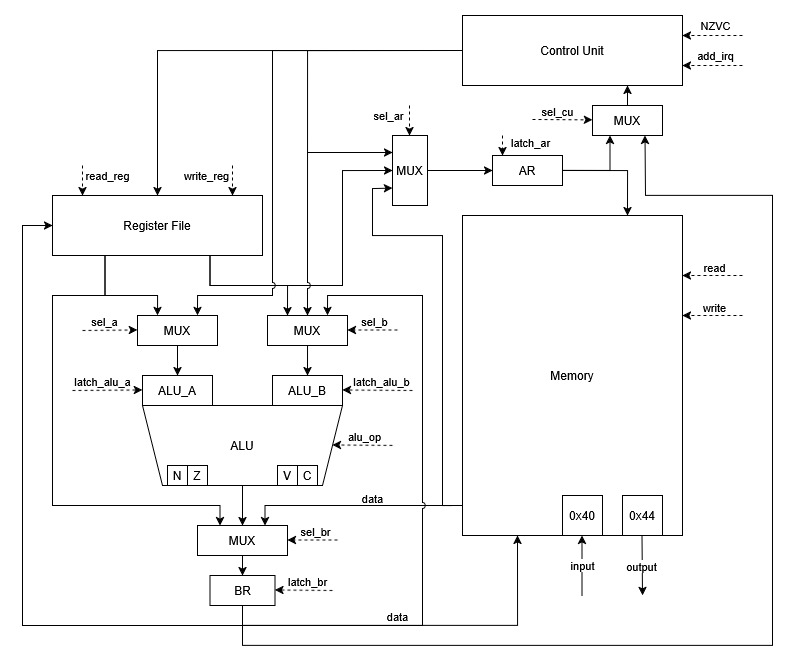
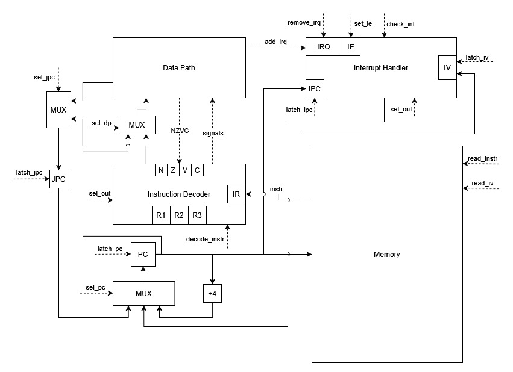

# Лабораторная работа 4
Выполнил: `Пышкин Никита Сергеевич, P3213`<br>
Вариант: `alg | risc | neum | hw | tick | binary | trap | mem | cstr | cache`

Расшифровка варианта:
 - `alg` - синтаксис языка должен напоминать java/javascript/lua.
 - `risc` - система команд должна быть упрощенной, в духе RISC архитектур.
 - `neum` - для организации памяти используется фон Неймановская архитектура.
 - `hw` - устройство управления реализуется как часть модели.
 - `tick` - процессор необходимо моделировать с точностью до такта.
 - `binary` - бинарное представление машинного кода.
 - `trap` - ввод-вывод осуществляется токенами через систему прерываний.
 - `mem` - memory-mapped ввод и вывод (порты ввода-вывода отображаются в память).
 - `cstr` - строки должны быть в C формате.
 - `cache` - работа с памятью реализуется через кеш (усложение, не выполнено)

# Язык программирования
## Описание синтаксиса (Форма Бэкуса-Наура)
```
<программа> ::= <операция> | <операция> <программа>
<операция> ::= <объявление функции>
    | <вызов функции>
    | <цикл for>
    | <условный оператор if>
    | <операция присвоения>
    | <операция инициализации>
    | <операция вывода>
    | <пробельная последовательность>

<пробельная последовательность> ::= (<пробел> | <комментарий>) (<пробельная последовательность> | <пусто>)
<комментарий> ::= "#" <последовательность символов> "\n"

<объявление функции> ::= <тип данных> <переменная> "[" (<список аргументов>) "]" "{"
    (<тело функции> | <пусто>)
"}"

<список аргументов> ::= <аргумент> | <аргумент> "," <список аргументов> | <пусто>
<аргумент> ::= <переменная> ":" <тип данных>

<операция в функции> ::= <операция> | <выход из функции>
<тело функции> ::= <операция в функции>  | <операция в функции> <тело функции>

<вызов функции> ::= <переменная> "(" <набор выражений> ")"
<выход из функции> ::= "return" ":" (<выражение> | <пусто>)

<цикл for> ::= "for" "["
    (<операция инициализации> | <операция присвоения> | <пусто>)
    (<булево выражение> | <пусто>)
    (<операция присвоения> | <пусто>)
"]" "{" <тело цикла> "}"

<тело цикла> ::= <операции в цикле> | <тело цикла> <операции в цикле>
<операции в цикле> ::= <программа> | <манипуляции циклом>
<манипуляции циклом> ::= "break" | "continue"

<условный оператор if> ::=
    "if" "[" <булево выражение> "]" "{" <программа> "}"
    ("elif" "[" <булево выражение> "]" "{" <программа> "}" | <пусто>)
    ("else" "{" <программа> "}" | <пусто>)

<операция инициализации> ::= <переменная> ":" <тип данных> "=" (<выражение> | <операция ввода>)
<операция присвоения> ::= <переменная> "=" (<выражение> | <операция ввода>)

<операция ввода> ::= "input" "(" (<число> | <пусто>) ")"
<операция вывода> ::= "print" "(" (<набор выражений> | <пусто>) ")"

<набор выражений> ::= <выражение> | <выражение> "," <набор выражений>

<тип данных> ::= "int32" | "str" | "void"

<булево выражение> ::= <булево OR>
<булево OR> ::= <булево AND> | <булево OR> "or" <булево AND>
<булево AND> ::= <булево NOT> | <булево AND> "and" <булево NOT>
<булево NOT> ::= <выражение сравнения> | "not" <булево NOT>
<выражение сравнения> ::= <выражение> | <выражение> <операция сравнения> <выражение>
<операция сравнения> ::= "==" | "<" | "<=" | ">" | ">=" | "!="

<выражение> ::= <слагаемое> | <слагаемое> ("+" | "-") <выражение>
<слагаемое> ::= <множитель> | <множитель> ("*" | "/" | "%") <слагаемое>
<множитель> ::= <битовый операнд> | <битовый операнд> ("<<" | ">>") <множитель>
<битовый операнд> ::= <базовый элемент> | "(" <булево выражение> ")" | "-" <битовый операнд>
<базовый элемент> ::= <переменная> | <число> | <строка> | <вызов функции>

<число> ::= <последовательность цифр>
<последовательность цифр> ::= <цифра> | <цифра> <последовательность цифр>

<строка> ::= '"' (<последовательность символов> | <пусто>) '"'
<последовательность символов> ::= <символ> | <символ> <последовательность символов>
<символ> ::= ? любой символ кроме '"' ?

<переменная> ::= (<буква> | "_") | (<буква> | "_") <название переменной>
<название переменной> ::= <символ переменной> | <символ переменной> <название переменной>
<символ переменной> ::= <цифра> | <буква> | "_"

<пусто> ::= ε
<пробел> ::= "\n" | "\t" | " "
<цифра> ::= "0" | "1" | "2" | "3" | "4" | "5" | "6" | "7" | "8" | "9"
<буква> ::= "A" | "B" | "C" | "D" | "E" | "F" | "G" | "H" | "I" | "J"
    | "K" | "L" | "M" | "N" | "O" | "P" | "Q" | "R" | "S" | "T" | "U"
    | "V" | "W" | "X" | "Y" | "Z" | "a" | "b" | "c" | "d" | "e" | "f"
    | "g" | "h" | "i" | "j" | "k" | "l" | "m" | "n" | "o" | "p" | "q"
    | "r" | "s" | "t" | "u" | "v" | "w" | "x" | "y" | "z"
```

## Описание семантики

### Стратегия вычислений
Арифметические и логические выражения вычисляются слева-направо, с учетом следующего приоритета операторов (чем выше значение в таблице, тем больше у него приоритет):

|  Приоритет  |            Название           |             Синтаксис             |
|:-----------:|:-----------------------------:|:---------------------------------:|
| `1`         | `Группировка`                 | `(...)`                           |
| `2`         | `Унарный минус`               | `-`                               |
| `3`         | `Побитовые сдвиги`            | `<<`, `>>`                        |
| `4`         | `Умножение, Деление, Остаток` | `*`, `/`, `%`                     |
| `5`         | `Сложение, Вычитание`         | `+`, `-`                          |
| `6`         | `Сравнения`                   | `==`, `!=`, `<`, `<=`, `>`, `>=`  |
| `7`         | `Логическое НЕ`               | `not`                             |
| `8`         | `Логическое И`                | `and`                             |
| `9`         | `Логическое ИЛИ`              | `or`                              |

Аргументы функции вычисляются до вызова функции, так же слева-направо. Вычисленное значение копируется в новую область памяти, выделенную специально для аргументов функции.

### Область видимости
Область видимости переменной ограничена ровно той функцией, в которой она была объявлена (если переменная объявлена вне какой-либо функции, то она видно только вне функций). Переменные с одинаковым именем не могут быть объявлены на одном и том же уровне видимости.
```
number:int32 = 3
if [number < 5] {
    number = number + 1
}
print(number)  # 4
```
Для функций работают те же правила области видимости, что и для переменных.
```
void do_something[] {
    void do_print[] {
        print(52)
    }

    do_print()
}

do_something()  # 52
do_print()  # Ошибка
```

### Типизация. Виды литералов
Типизация сильная и строгая. При этом есть следующие типы данных:
 - `str` - строковый тип данных, текст пишется в двойных кавычках.
 - `int32` - численный тип данных, используется только для целых чисел.
 - `void` - без типа данных, используется для функций, которые ничего не возвращают.

Булевый тип данных отсутствует, вместо него следует использовать `int32`.

# Транслятор
Будет позже...

# Организация памяти

## Машинное слово
В данной лабораторной работе используется фон Неймовская 32-битная архитектура (соответственно, ширина машинного слова - 32 бита). Порядок байтов в машинном слове - little-endian.

## Регистры
Модель процессора включает себя следующий набор служебных регистров (защелок), недоступных для изменения программистом:
 - `PC` - 32-битный регистр, который хранит адрес следующей инструкции.
 - `IRQ` - 17-битный регистр, который хранит флаг `IE` (разрешение прерываний) и по одному бит для каждого из источника прерываний.
 - `IR`, `AR`, `BR`, `IPC`, `IBR` - 32-битные регистры для сохранения инструкций, адреса, счетчика значений (в прерываниях) и промежуточных значений.
 - `R1`, `R2`, `R3` - 5-битные регистры, хранящие идентификаторы регистров общего назначения.
 - `ALU_A`, `ALU_B` - 32-битные входы АЛУ (левый и правый соответственно)
 - `NZVC` - 4-битный регистр, хранящий флаги результатов операции АЛУ.

Помимо служебных, процессор включает в себя 32 регистра, доступных программисту: `S1`, `S2`, `S3`, `S4`, `S5`, `S6`, `S7`, `S8`, `S9`, `S10`, `S11`, `S12`, `I1`, `I2`, `T1`, `T2`, `T3`, `T4`, `T5`, `T6`, `T7`, `T8`, `A1`, `A2`, `A3`, `A4`, `A5`, `A6`, `A7`, `A8`, `Ra`, `Sp`.<br>

Назначение регистров:
 - `Sp` - адрес верхушки стека
 - `Ra` - адрес возврата из функции
 - `I1`-`I2` - регистры, используемые только в прерываниях
 - `A1`-`A8` - аргументы и возвращаемое значение функции, если регистров не хватает, используется стек
 - `T1`-`T8` - регистры общего назначения, должны сохраняться вызывающей стороной (caller-saved регистры)
 - `S1`-`S12` - регистры общего назначения, должны сохраняться вызванной стороной (callee-saved регистры)

Примечание: ответственность за обработку регистров `Sp` и `Ra` полностью лежит на плечах программиста, никакая из команд не изменяет значения этих переменных по умолчанию.

## Варианты адресации
В кодируемых командах длина КОП = 7 бит (3 из которых заняты под вид адресации), длина идентификатора регистра = 5 бит.

|                   Адресация                   | Кодировка адресации |
|-----------------------------------------------|:-------------------:|
| Абсолютная адресация                          |        `000`        |
| Относительная адресация                       |        `001`        |
| Безадресная адресация                         |        `011`        |
| Регистровая адресация (1 регистр)             |        `100`        |
| Регистровая адресация (2 регистра)            |        `101`        |
| Регистровая адресация (3 регистра)            |        `110`        |
| Прямая загрузка                               |        `111`        |
<!--
| Ветвление                                     |        `010`        |
-->

Резерв: `010`

### Абсолютная адресация
Абсолютная адресация применяется в следующих ситуациях:
 - Загрузки в регистр значения из ячейки по абсолютному адресу.
 - Сохранение значения из регистра в ячейку по абсолютному адресу.

```
31                                              12          7               0
+-----------------------------------------------+-----------+---------------+
|                     АДРЕС                     |  РЕГИСТР  |      КОП      |
+-----------------------------------------------+-----------+---------------+
```

Так как в данном варианте адрес занимает 20 бит, максимальное значение, которое можно загрузить таким образом: `0XFFFFF` (что соответствует `2^20 - 1` в десятичной системе счисления).

### Относительная адресация
Относительная адресация используется для переходов по адресам относительно `pc` (например, в ветвлениях).

```
31                                                         7               0
+----------------------------------------------------------+---------------+
|                         ЗНАЧЕНИЕ                         |      КОП      |
+----------------------------------------------------------+---------------+
```

Значение занимает 25 бит, поэтому диапазоном для сдвига являются значения [`-2^24`; `2^24 - 1`] (другими словами значение интерпретируется как знаковое число).

### Регистровая адресация
Адресация, которая используется в большинстве команд для данной архитектуры. Она работает только с регистрами, без обращения к памяти. Большинство из них это бинарные/унарные операции, но в этот список так же входят операции управления потоком исполнения.
```
31                                            12          7               0
+---------------------------------------------+-----------+---------------+
|   0 0 0 0 0 0 0 0 0 0 0 0 0 0 0 0 0 0 0 0   |  РЕГИСТР  |      КОП      |
+---------------------------------------------+-----------+---------------+
```
```
31                                17          12          7               0
+---------------------------------+-----------+-----------+---------------+
|  0 0 0 0 0 0 0 0 0 0 0 0 0 0 0  |  РЕГИСТР  |  РЕГИСТР  |      КОП      |
+---------------------------------+-----------+-----------+---------------+
```
```
31                    22          17          12          7               0
+---------------------+-----------+-----------+-----------+---------------+
| 0 0 0 0 0 0 0 0 0 0 |  РЕГИСТР  |  РЕГИСТР  |  РЕГИСТР  |      КОП      |
+---------------------+-----------+-----------+-----------+---------------+
```

<!--
### Ветвления
Адресация, которая используется для перехода в ветвлениях:
```
31                                                        7               0
+---------------------------------------------------------+---------------+
|                            АДРЕС                        |      КОП      |
+---------------------------------------------------------+---------------+
```
Адрес занимает 25 бит, поэтому максимальная ячейка, на которую можно прыгнуть таким образом, является `0X1FFFFFF` (что соответствует `2^25 - 1` в десятичной системе счисления).<br><br>
Помимо варианта выше, есть команды, которые относятся к операциям ветвления, но при этом используют регистровую адресацию:
```
31                                17          12          7               0
+---------------------------------+-----------+-----------+---------------+
|   0 0 0 0 0 0 0 0 0 0 0 0 0 0   |  РЕГИСТР  |  РЕГИСТР  |      КОП      |
+---------------------------------+-----------+-----------+---------------+
```
```
31                                            12          7               0
+---------------------------------------------+-----------+---------------+
|   0 0 0 0 0 0 0 0 0 0 0 0 0 0 0 0 0 0 0 0   |  РЕГИСТР  |      КОП      |
+---------------------------------------------+-----------+---------------+
```
-->

### Безадресная адресация
Применяется для команд, которым не нужно взаимодествовать с регистрами общего назначения и адресами.
```
31                                                        7               0
+---------------------------------------------------------+---------------+
|    0 0 0 0 0 0 0 0 0 0 0 0 0 0 0 0 0 0 0 0 0 0 0 0 0    |      КОП      |
+---------------------------------------------------------+---------------+
```

### Прямая загрузка
Адресация для загрузки литерала в регистр.
```
31                                            12          7               0
+---------------------------------------------+-----------+---------------+
|                   ЗНАЧЕНИЕ                  |  РЕГИСТР  |      КОП      |
+---------------------------------------------+-----------+---------------+
```

## Расположение данных в памяти
Как уже было сказано ранее, процессор использует концепцию фон Неймана, поэтому все инструкции, данные, процедуры и т.д. находятся на одной ленте памяти. При этом, расположены в памяти они следующим образом:
```
+--------------------------------------------------+
|                Вектора прерываний                |
+--------------------------------------------------+
| 00  : вектор прерывания 1                        |
| 01  : вектор прерывания 2                        |
|    ...                                           |
| 0F  : вектор прерывания 16                       |
+--------------------------------------------------+
|                Порты ввода-вывода                |
+--------------------------------------------------+
| 10  : порт ввода                                 |
| 11  : порт вывода                                |
+--------------------------------------------------+
|               Константы (c - метка)              |
+--------------------------------------------------+
| c+0 : константные данные 1                       |
| c+1 : константные данные 2                       |
|    ...                                           |
| c+N : константные данные N                       |
+--------------------------------------------------+
|              Переменные (d - метка)              |
+--------------------------------------------------+
| d+0 : переменная 1                               |
| d+1 : переменная 2                               |
|    ...                                           |
| d+N : переменная N                               |
+--------------------------------------------------+
|          Основная программа (p - метка)          |
+--------------------------------------------------+
| p+0 : инструкция 1                               |
| p+1 : инструкция 2                               |
|    ...                                           |
| p+N : инструкция N                               |
+--------------------------------------------------+
|  Процедуры и обработчики прерываний (f - метка)  |
+--------------------------------------------------+
| f+0 : процедура/обработчик 1                     |
|    ...                                           |
| f+N : процедура/обработчик N                     |
+--------------------------------------------------+
|                       Стек                       |
+--------------------------------------------------+
| ??? : конец стека                                |
|    ...                                           |
| MAX : начало стека                               |
+--------------------------------------------------+
```

### Вектора прерываний
Всего доступно 16 векторов прерываний (из них используется не все, большая часть - резерв), которые расположены в самом начале памяти. По этим адресам находятся адреса обработчиков прерываний (чем меньше адрес, тем больше приоритет у прерывания). Если прерывание не обрабатывается, то нужно все равно оставить обработчик-заглушку (обработчик, который будет ничего не делать и возвращать программу в обычный поток выполнения).<br><br>
Обработка прерывания является аппаратно-программной: служебные регистры сохраняются системой в теневые регистры, все остальные регистры (если они требуются) должны быть сохранены программистом. Во время обработки одного прерывания, система блокирует выполнение других прерываний, в том числе и от одного и того же устройства (поэтому обработчики прерываний должны быть как можно более компактными, чтобы не потерять данные). Для выхода из обработчика прерывания используется специальная команда, которая вернет систему в состояние до прерывания и установит флаг IE в 1.

### Порты ввода-вывода
Порты ввода и вывода мапятся на адреса памяти. Конфигурация процессора по умолчанию делает это на адреса, которые находятся сразу же за портами ввода и вывода.

### Константы
Константные значения идут после портов ввода-вывода. Все константы располагаются вплотную друг к другу (а если точнее, вплотную располагаются машинные слова с константами). Является ли переменная константой - определяет компилятор или программист.

### Переменные
Переменные идут после констант. Если переменная является числом (или любым другим типом данных, для хранения которого нужно фиксированное количество машинных слов), то она располагается вплотную к следующей за ней переменной. Иначе, нужное место для переменной вычисляется компилятором.<br><br>
Стоит отметить, что численные переменные (или любые другие, если они помещаются в одно машинное слово) отображаются в регистры общего назначения. Только если регистров не хватает, переменная отображается в память.

### Основная программа
Основная программа находится после переменных. Ее точное положение определяется компилятором.

### Процедуры и обработчики прерываний
Процедуры и обработчики прерываний (которые по своей сути тоже являются процедурами), находятся сразу же за основной программой. Важно не забывать, что ответственность за поток выполнения программы лежит на программисте.

### Стек
В данной модели памяти стек не является аппаратной частью и реализуется полностью программно. Компилятор располагает его в самом конце памяти (с оглядкой на доступность через косвенную адресацию) и растит его вниз.

# Система команд

## Описание команд
Условные обозначения: `-` - операция не влияет на флаг, `*` - флаг выставляется по результату операции, `0` - операция сбрасывает флаг.

### Перемещение данных
|        синтаксис        |    КОП    | кол-во тактов |              краткое описание              |      NZVC      |
|-------------------------|:---------:|:-------------:|--------------------------------------------|:--------------:|
| `lui <r1> <value>`      | `1110000` |      `7`      | `<r1> <- <r1> + <value> & 0xFF00`          |     `----`     |
| `lli <r1> <value>`      | `1110001` |      `5`      | `<r1> <- <value> & 0x00FF`                 |     `----`     |
| `lw <r1> <addr>`        | `0000000` |      `5`      | `<r1> <- mem[<addr>]`                      |     `----`     |
| `sw <r1> <addr>`        | `0000001` |      `5`      | `mem[<addr>] <- <r1>`                      |     `----`     |
| `lwr <r1> <r2>`         | `1010010` |      `6`      | `<r1> <- mem[<r2>]`                        |     `----`     |
| `swr <r1> <r2>`         | `1010011` |      `5`      | `mem[<r2>] <- <r1>`                        |     `----`     |
| `mv <r1> <r2>`          | `1010101` |      `6`      | `<r1> <- <r2>`                             |     `----`     |

### Арифметические операции
|        синтаксис        |    КОП    | кол-во тактов |              краткое описание              |      NZVC      |
|-------------------------|:---------:|:-------------:|--------------------------------------------|:--------------:|
| `addi <r1> <value>`     | `1110010` |      `5`      | `<r1> <- <r1> + <value>`                   |     `****`     |
| `add <r1> <r2> <r3>`    | `1100000` |      `6`      | `<r1> <- <r2> + <r3>`                      |     `****`     |
| `sub <r1> <r2> <r3>`    | `1100001` |      `6`      | `<r1> <- <r2> - <r3>`                      |     `****`     |
| `mul <r1> <r2> <r3>`    | `1100010` |      `6`      | `<r1> <- <r2> * <r3>`                      |     `****`     |
| `div <r1> <r2> <r3>`    | `1100011` |      `6`      | `<r1> <- <r2> / <r3>`                      |     `***0`     |
| `rem <r1> <r2> <r3>`    | `1100100` |      `6`      | `<r1> <- <r2> % <r3>`                      |     `**00`     |
| `neg <r1> <r2>`         | `1010100` |      `6`      | `<r1> <- ~<r2> + 1`                        |     `****`     |

### Битовые операции
|        синтаксис        |    КОП    | кол-во тактов |              краткое описание              |      NZVC      |
|-------------------------|:---------:|:-------------:|--------------------------------------------|:--------------:|
| `and <r1> <r2> <r3>`    | `1100101` |      `6`      | `<r1> <- <r2> & <r3>`                      |     `**0-`     |
| `or <r1> <r2> <r3>`     | `1100110` |      `6`      | `<r1> <- <r2> \| <r3>`                     |     `**0-`     |
| `xor <r1> <r2> <r3>`    | `1100111` |      `6`      | `<r1> <- <r2> ^ <r3>`                      |     `**0-`     |
| `not <r1> <r2>`         | `1010000` |      `6`      | `<r1> <- ~<r2>`                            |     `**0-`     |
| `shl <r1> <r2> <r3>`    | `1101000` |      `6`      | `<r1> <- <r2> << <r3>`                     |     `**0*`     |
| `shr <r1> <r2> <r3>`    | `1101001` |      `6`      | `<r1> <- <r2> >> <r3>`                     |     `**0-`     |

### Операции сравнения
|        синтаксис        |    КОП    | кол-во тактов |              краткое описание              |      NZVC      |
|-------------------------|:---------:|:-------------:|--------------------------------------------|:--------------:|
| `cmp <r1> <r2>`         | `1010001` |      `5`      | `NZVC <- <r1> - <r2>`                      |     `****`     |
| `seteq <r1>`            | `1000010` |      `5`      | `<r1> <- (Z = 1)`                          |     `**00`     |
| `setne <r1>`            | `1000011` |      `5`      | `<r1> <- (Z = 0)`                          |     `**00`     |
| `setge <r1>`            | `1000100` |      `5`      | `<r1> <- (N = V)`                          |     `**00`     |
| `setle <r1>`            | `1000101` |      `5`      | `<r1> <- (N != V or Z = 1)`                |     `**00`     |
| `setsg <r1>`            | `1000110` |      `5`      | `<r1> <- (Z = 0 and N = V)`                |     `**00`     |
| `setsl <r1>`            | `1000111` |      `5`      | `<r1> <- (N != V)`                         |     `**00`     |

### Управление потоком исполнения
|        синтаксис        |    КОП    | кол-во тактов |                   краткое описание                   |      NZVC      |
|-------------------------|:---------:|:-------------:|------------------------------------------------------|:--------------:|
| `jal <r1> <addr>`       | `0000010` |      `6`      | `<r1> <- pc + 4, pc <- <addr>`                       |     `----`     |
| `jr <r1>`               | `1000000` |      `3`      | `pc <- <r1>`                                         |     `----`     |
| `jo k`                  | `0010000` |    `6`/`2`    | `pc <- pc + k`                                       |     `----`     |
| `jz k`                  | `0010001` |    `6`/`2`    | `if Z = 0 then pc <- pc + k`                         |     `----`     |
| `jnz k`                 | `0010010` |    `6`/`2`    | `if Z = 1 then pc <- pc + k`                         |     `----`     |
| `reti`                  | `0110000` |      `2`      | `IE = 1`, `restore pc`                               |     `----`     |
| `halt`                  | `0110001` |      `2`      | `stop the machine`                                   |     `----`     |

## Потактовое выполнение команд
Этапы выполнения команды:
 - Цикл обработки прерывания (INT)
 - Цикл выборки команды (IF)
 - Цикл декодирования команды (ID)
 - Цикл исполнения команды (EX)
 - Цикл обращения к памяти (MEM)
 - Цикл записи результата (WB)

Цикл обработки прерывания происходит параллельно со стадией `IF` у каждой команды. Происходит это следующим образом: `PC` отправляет свое значение в `IPC`, если `IE` установлен в 1, то выполнение текущей команды прерывается и в `PC` из Interrupt Handler уходит адрес обработчика прерывания (в зависимости от приоритета) и другие прерывания запрещаются (`IE` устанавливается в 0, `IPC` не принимает новые значения). После записи в `PC` вектора прерывания мы попадаем в обработчик прерывания, из которого потом выходим командой `reti`.<br>

Допущения: процессор оптимизирован для загрузки значений сразу из двух регистров в АЛУ.

### Перемещение данных

#### LUI (Load Upper Immediate): `lui <r1> <value>`
| Такт |  Стадия  |               Действие               |
|:----:|:--------:|--------------------------------------|
| `1`  |   `IF`   | `IPC <- PC, IR <- [PC]`              |
| `2`  |   `IF`   | `PC <- PC + 4`                       |
| `3`  |   `ID`   | `R1 <- IR[7:11], ALU_B <- IR[12:31]` |
| `4`  |   `EX`   | `BR <- ALU_B & 0xFF00`               |
| `5`  |   `EX`   | `ALU_A <- [R1], ALU_B <- BR`         |
| `6`  |   `EX`   | `BR <- ALU_A + ALU_B`                |
| `7`  |   `WB`   | `[R1] <- BR`                         |

#### LLI (Load Lower Immediate): `lli <r1> <value>`
| Такт |  Стадия  |               Действие               |
|:----:|:--------:|--------------------------------------|
| `1`  |   `IF`   | `IPC <- PC, IR <- [PC]`              |
| `2`  |   `IF`   | `PC <- PC + 4`                       |
| `3`  |   `ID`   | `R1 <- IR[7:11], ALU_B <- IR[12:31]` |
| `4`  |   `EX`   | `BR <- ALU_B & 0x00FF`               |
| `5`  |   `WB`   | `[R1] <- BR`                         |

#### LW (Load Word): `lw <r1> <addr>`
| Такт |  Стадия  |               Действие               |
|:----:|:--------:|--------------------------------------|
| `1`  |   `IF`   | `IPC <- PC, IR <- [PC]`              |
| `2`  |   `IF`   | `PC <- PC + 4`                       |
| `3`  |   `ID`   | `R1 <- IR[7:11], AR <- IR[12:31]`    |
| `4`  |   `MEM`  | `BR <- [AR]`                         |
| `5`  |   `WB`   | `[R1] <- BR`                         |

#### SW (Save Word): `sw <r1> <addr>`
| Такт |  Стадия  |               Действие               |
|:----:|:--------:|--------------------------------------|
| `1`  |   `IF`   | `IPC <- PC, IR <- [PC]`              |
| `2`  |   `IF`   | `PC <- PC + 4`                       |
| `3`  |   `ID`   | `R1 <- IR[7:11], AR <- IR[12:31]`    |
| `4`  |   `EX`   | `BR <- [R1]`                         |
| `5`  |   `MEM`  | `[AR] <- BR`                         |

#### LWR (Load Word from Register): `lwr <r1> <r2>`
| Такт |  Стадия  |               Действие               |
|:----:|:--------:|--------------------------------------|
| `1`  |   `IF`   | `IPC <- PC, IR <- [PC]`              |
| `2`  |   `IF`   | `PC <- PC + 4`                       |
| `3`  |   `ID`   | `R1 <- IR[7:11], R2 <- IR[12:16]`    |
| `4`  |   `EX`   | `AR <- [R2]`                         |
| `5`  |   `MEM`  | `BR <- [AR]`                         |
| `6`  |   `WB`   | `[R1] <- BR`                         |

#### SWR (Save Word to Register): `swr <r1> <r2>`
| Такт |  Стадия  |               Действие               |
|:----:|:--------:|--------------------------------------|
| `1`  |   `IF`   | `IPC <- PC, IR <- [PC]`              |
| `2`  |   `IF`   | `PC <- PC + 4`                       |
| `3`  |   `ID`   | `R1 <- IR[7:11], R2 <- IR[12:16]`    |
| `4`  |   `EX`   | `AR <- [R2], BR <- [R1]`             |
| `5`  |   `WB`   | `[AR] <- BR`                         |

#### MV (Move): `mv <r1> <r2>`
| Такт |  Стадия  |               Действие               |
|:----:|:--------:|--------------------------------------|
| `1`  |   `IF`   | `IPC <- PC, IR <- [PC]`              |
| `2`  |   `IF`   | `PC <- PC + 4`                       |
| `3`  |   `ID`   | `R1 <- IR[7:11], R2 <- IR[12:16]`    |
| `4`  |   `EX`   | `ALU_B <- [R2]`                      |
| `5`  |   `EX`   | `BR <- ALU_B`                        |
| `6`  |   `WB`   | `[R1] <- BR`                         |

### Арифметические операции

#### ADDI (Signed Addition Immediate): `<r1> <- <r1> + <value>`
| Такт |  Стадия  |               Действие               |
|:----:|:--------:|--------------------------------------|
| `1`  |   `IF`   | `IPC <- PC, IR <- [PC]`              |
| `2`  |   `IF`   | `PC <- PC + 4`                       |
| `3`  |   `ID`   | `R1 <- IR[7:11], ALU_B <- IR[12:31]` |
| `4`  |   `EX`   | `ALU_A <- [R1]`                      |
| `5`  |   `EX`   | `BR, NZVC <- ALU_A + ALU_B`          |
| `6`  |   `WB`   | `[R1] <- BR`                         |

#### ADD (Signed Addition): `add <r1> <r2> <r3>`
| Такт |  Стадия  |                      Действие                      |
|:----:|:--------:|----------------------------------------------------|
| `1`  |   `IF`   | `IPC <- PC, IR <- [PC]`                            |
| `2`  |   `IF`   | `PC <- PC + 4`                                     |
| `3`  |   `ID`   | `R1 <- IR[7:11], R2 <- IR[12:16], R3 <- IR[17:21]` |
| `4`  |   `EX`   | `ALU_A <- [R2], ALU_B <- [R3]`                     |
| `5`  |   `EX`   | `BR, NZVC <- ALU_A + ALU_B`                        |
| `6`  |   `WB`   | `[R1] <- BR`                                       |

#### SUB (Signed Subtraction): `sub <r1> <r2> <r3>`
| Такт |  Стадия  |                      Действие                      |
|:----:|:--------:|----------------------------------------------------|
| `1`  |   `IF`   | `IPC <- PC, IR <- [PC]`                            |
| `2`  |   `IF`   | `PC <- PC + 4`                                     |
| `3`  |   `ID`   | `R1 <- IR[7:11], R2 <- IR[12:16], R3 <- IR[17:21]` |
| `4`  |   `EX`   | `ALU_A <- [R2], ALU_B <- [R3]`                     |
| `5`  |   `EX`   | `BR, NZVC <- ALU_A - ALU_B`                        |
| `6`  |   `WB`   | `[R1] <- BR`                                       |

#### MUL (Signed Multiply): `mul <r1> <r2> <r3>`
| Такт |  Стадия  |                      Действие                      |
|:----:|:--------:|----------------------------------------------------|
| `1`  |   `IF`   | `IPC <- PC, IR <- [PC]`                            |
| `2`  |   `IF`   | `PC <- PC + 4`                                     |
| `3`  |   `ID`   | `R1 <- IR[7:11], R2 <- IR[12:16], R3 <- IR[17:21]` |
| `4`  |   `EX`   | `ALU_A <- [R2], ALU_B <- [R3]`                     |
| `5`  |   `EX`   | `BR, NZVC <- ALU_A * ALU_B`                        |
| `6`  |   `WB`   | `[R1] <- BR`                                       |

#### DIV (Signed Division): `div <r1> <r2> <r3>`
| Такт |  Стадия  |                      Действие                      |
|:----:|:--------:|----------------------------------------------------|
| `1`  |   `IF`   | `IPC <- PC, IR <- [PC]`                            |
| `2`  |   `IF`   | `PC <- PC + 4`                                     |
| `3`  |   `ID`   | `R1 <- IR[7:11], R2 <- IR[12:16], R3 <- IR[17:21]` |
| `4`  |   `EX`   | `ALU_A <- [R2], ALU_B <- [R3]`                     |
| `5`  |   `EX`   | `BR, NZVC <- ALU_A / ALU_B`                        |
| `6`  |   `WB`   | `[R1] <- BR`                                       |

#### REM (Signed Remainder): `rem <r1> <r2> <r3>`
| Такт |  Стадия  |                      Действие                      |
|:----:|:--------:|----------------------------------------------------|
| `1`  |   `IF`   | `IPC <- PC, IR <- [PC]`                            |
| `2`  |   `IF`   | `PC <- PC + 4`                                     |
| `3`  |   `ID`   | `R1 <- IR[7:11], R2 <- IR[12:16], R3 <- IR[17:21]` |
| `4`  |   `EX`   | `ALU_A <- [R2], ALU_B <- [R3]`                     |
| `5`  |   `EX`   | `BR, NZVC <- ALU_A % ALU_B`                        |
| `6`  |   `WB`   | `[R1] <- BR`                                       |

#### Negative (Negative): `neg <r1> <r2>`
| Такт |  Стадия  |              Действие              |
|:----:|:--------:|------------------------------------|
| `1`  |   `IF`   | `IR <- [PC]`                       |
| `2`  |   `IF`   | `PC <- PC + 4`                     |
| `3`  |   `ID`   | `R1 <- IR[7:11], R2 <- IR[12:16]`  |
| `4`  |   `EX`   | `ALU_A <- [R2]`                    |
| `5`  |   `EX`   | `BR, NZVC <- ~ALU_A + 1`           |
| `6`  |   `WB`   | `[R1] <- BR`                       |

### Битовые операции

#### AND (Logical And): `and <r1> <r2> <r3>`
| Такт |  Стадия  |                      Действие                      |
|:----:|:--------:|----------------------------------------------------|
| `1`  |   `IF`   | `IPC <- PC, IR <- [PC]`                            |
| `2`  |   `IF`   | `PC <- PC + 4`                                     |
| `3`  |   `ID`   | `R1 <- IR[7:11], R2 <- IR[12:16], R3 <- IR[17:21]` |
| `4`  |   `EX`   | `ALU_A <- [R2], ALU_B <- [R3]`                     |
| `5`  |   `EX`   | `BR, NZVC <- ALU_A & ALU_B`                        |
| `6`  |   `WB`   | `[R1] <- BR`                                       |

#### OR (Logical Or): `or <r1> <r2> <r3>`
| Такт |  Стадия  |                      Действие                      |
|:----:|:--------:|----------------------------------------------------|
| `1`  |   `IF`   | `IPC <- PC, IR <- [PC]`                            |
| `2`  |   `IF`   | `PC <- PC + 4`                                     |
| `3`  |   `ID`   | `R1 <- IR[7:11], R2 <- IR[12:16], R3 <- IR[17:21]` |
| `4`  |   `EX`   | `ALU_A <- [R2], ALU_B <- [R3]`                     |
| `5`  |   `EX`   | `BR, NZVC <- ALU_A \| ALU_B`                       |
| `6`  |   `WB`   | `[R1] <- BR`                                       |

#### XOR (Logical Xor): `xor <r1> <r2> <r3>`
| Такт |  Стадия  |                      Действие                      |
|:----:|:--------:|----------------------------------------------------|
| `1`  |   `IF`   | `IPC <- PC, IR <- [PC]`                            |
| `2`  |   `IF`   | `PC <- PC + 4`                                     |
| `3`  |   `ID`   | `R1 <- IR[7:11], R2 <- IR[12:16], R3 <- IR[17:21]` |
| `4`  |   `EX`   | `ALU_A <- [R2], ALU_B <- [R3]`                     |
| `5`  |   `EX`   | `BR, NZVC <- ALU_A ^ ALU_B`                        |
| `6`  |   `WB`   | `[R1] <- BR`                                       |

#### NOT (Logical Not): `not <r1> <r2>`
| Такт |  Стадия  |              Действие              |
|:----:|:--------:|------------------------------------|
| `1`  |   `IF`   | `IR <- [PC]`                       |
| `2`  |   `IF`   | `PC <- PC + 4`                     |
| `3`  |   `ID`   | `R1 <- IR[7:11], R2 <- IR[12:16]`  |
| `4`  |   `EX`   | `ALU_A <- [R2]`                    |
| `5`  |   `EX`   | `BR, NZVC <- ~ALU_A`               |
| `6`  |   `WB`   | `[R1] <- BR`                       |

#### SHL (Arithmetic Shift Left): `shl <r1> <r2> <r3>`
| Такт |  Стадия  |                      Действие                      |
|:----:|:--------:|----------------------------------------------------|
| `1`  |   `IF`   | `IPC <- PC, IR <- [PC]`                            |
| `2`  |   `IF`   | `PC <- PC + 4`                                     |
| `3`  |   `ID`   | `R1 <- IR[7:11], R2 <- IR[12:16], R3 <- IR[17:21]` |
| `4`  |   `EX`   | `ALU_A <- [R2], ALU_B <- [R3]`                     |
| `5`  |   `EX`   | `BR, NZVC <- ALU_A << ALU_B`                       |
| `6`  |   `WB`   | `[R1] <- BR`                                       |

#### SHR (Arithmetic Shift Right): `shr <r1> <r2> <r3>`
| Такт |  Стадия  |                      Действие                      |
|:----:|:--------:|----------------------------------------------------|
| `1`  |   `IF`   | `IPC <- PC, IR <- [PC]`                            |
| `2`  |   `IF`   | `PC <- PC + 4`                                     |
| `3`  |   `ID`   | `R1 <- IR[7:11], R2 <- IR[12:16], R3 <- IR[17:21]` |
| `4`  |   `EX`   | `ALU_A <- [R2], ALU_B <- [R3]`                     |
| `5`  |   `EX`   | `BR, NZVC <- ALU_A >> ALU_B`                       |
| `6`  |   `WB`   | `[R1] <- BR`                                       |

### Операции сравнения

#### CMP (Compare): `cmp <r1> <r2>`
| Такт |  Стадия  |                    Действие                    |
|:----:|:--------:|------------------------------------------------|
| `1`  |   `IF`   | `IR <- [PC]`                                   |
| `2`  |   `IF`   | `PC <- PC + 4`                                 |
| `3`  |   `ID`   | `R1 <- IR[7:11], R2 <- IR[12:16]`              |
| `4`  |   `EX`   | `ALU_A <- [R1], ALU_B <- [R2]`                 |
| `5`  |   `EX`   | `NZVС <- ALU_A - ALU_B`                        |

#### SETEQ (Set if Equal): `seteq <r1>`
| Такт |  Стадия  |                   Действие                   |
|:----:|:--------:|----------------------------------------------|
| `1`  |   `IF`   | `IPC <- PC, IR <- [PC]`                      |
| `2`  |   `IF`   | `PC <- PC + 4`                               |
| `3`  |   `ID`   | `R1 <- IR[7:11], ALU_B <- (Z = 1)`           |
| `4`  |   `EX`   | `NZVC, BR <- ALU_B`                          |
| `5`  |   `WB`   | `[R1] <- BR`                                 |

#### SETNE (Set if Not Equal): `setne <r1>`
| Такт |  Стадия  |                   Действие                   |
|:----:|:--------:|----------------------------------------------|
| `1`  |   `IF`   | `IPC <- PC, IR <- [PC]`                      |
| `2`  |   `IF`   | `PC <- PC + 4`                               |
| `3`  |   `ID`   | `R1 <- IR[7:11], ALU_B <- (Z = 0)`           |
| `4`  |   `EX`   | `NZVC, BR <- ALU_B`                          |
| `5`  |   `WB`   | `[R1] <- BR`                                 |

#### SETGE (Set if Greater or Equal): `setge <r1>`
| Такт |  Стадия  |                   Действие                   |
|:----:|:--------:|----------------------------------------------|
| `1`  |   `IF`   | `IPC <- PC, IR <- [PC]`                      |
| `2`  |   `IF`   | `PC <- PC + 4`                               |
| `3`  |   `ID`   | `R1 <- IR[7:11], ALU_B <- (N = V)`           |
| `4`  |   `EX`   | `NZVC, BR <- ALU_B`                          |
| `5`  |   `WB`   | `[R1] <- BR`                                 |

#### SETLE (Set if Less or Equal): `setle <r1>`
| Такт |  Стадия  |                   Действие                   |
|:----:|:--------:|----------------------------------------------|
| `1`  |   `IF`   | `IPC <- PC, IR <- [PC]`                      |
| `2`  |   `IF`   | `PC <- PC + 4`                               |
| `3`  |   `ID`   | `R1 <- IR[7:11], ALU_B <- (N != V or Z = 1)` |
| `4`  |   `EX`   | `NZVC, BR <- ALU_B`                          |
| `5`  |   `WB`   | `[R1] <- BR`                                 |

#### SETSG (Set if Strictly Greater): `setsg <r1>`
| Такт |  Стадия  |                   Действие                   |
|:----:|:--------:|----------------------------------------------|
| `1`  |   `IF`   | `IPC <- PC, IR <- [PC]`                      |
| `2`  |   `IF`   | `PC <- PC + 4`                               |
| `3`  |   `ID`   | `R1 <- IR[7:11], ALU_B <- (Z = 0 and N = V)` |
| `4`  |   `EX`   | `NZVC, BR <- ALU_B`                          |
| `5`  |   `WB`   | `[R1] <- BR`                                 |

#### SETSL (Set if Strictly Less): `setsl <r1>`
| Такт |  Стадия  |                   Действие                   |
|:----:|:--------:|----------------------------------------------|
| `1`  |   `IF`   | `IPC <- PC, IR <- [PC]`                      |
| `2`  |   `IF`   | `PC <- PC + 4`                               |
| `3`  |   `ID`   | `R1 <- IR[7:11], ALU_B <- (N != V)`          |
| `4`  |   `EX`   | `NZVC, BR <- ALU_B`                          |
| `5`  |   `WB`   | `[R1] <- BR`                                 |

### Управление потоком исполнения

#### JAL (Jump And Link): `jal <r1> <addr>`
| Такт |  Стадия  |                    Действие                    |
|:----:|:--------:|------------------------------------------------|
| `1`  |   `IF`   | `IPC <- PC, IR <- [PC]`                        |
| `2`  |   `IF`   | `PC <- PC + 4`                                 |
| `3`  |   `ID`   | `R1 <- IR[7:11], AR <- IR[12:31]`              |
| `4`  |   `EX`   | `IBR <- AR, ALU_B <- [R1]`                     |
| `5`  |   `EX`   | `BR <- ALU_B`                                  |
| `6`  |   `WB`   | `[R1] <- BR`                                   |

#### JR (Jump Register): `jr <r1>`
| Такт |  Стадия  |                    Действие                    |
|:----:|:--------:|------------------------------------------------|
| `1`  |   `IF`   | `IPC <- PC, IR <- [PC]`                        |
| `2`  |   `ID`   | `ALU_B <- IR[7:31]`                            |
| `3`  |   `EX`   | `AR <- [R1], IBR <- AR, PC <- IBR`             |

#### JO (Jump Offset): `jo k`
| Такт |  Стадия  |                    Действие                    |
|:----:|:--------:|------------------------------------------------|
| `1`  |   `IF`   | `IPC <- PC, IR <- [PC]`                        |
| `2`  |   `ID`   | `ALU_A <- PC`                                  |
| `3`  |   `ID`   | `ALU_B <- IR[7:11]`                            |
| `4`  |   `EX`   | `BR <- ALU_A + ALU_B`                          |
| `5`  |   `EX`   | `IBR <- BR, PC <- IBR`                         |

#### JZ (Jump if Zero): `jz k`
| Такт |  Стадия  |                    Действие                    |
|:----:|:--------:|------------------------------------------------|
| `1`  |   `IF`   | `IPC <- PC, IR <- [PC]`                        |
| `2`  |   `IF`   | `if Z != 0 then PC <- PC + 4, skip next steps` |
| `3`  |   `ID`   | `ALU_A <- PC`                                  |
| `4`  |   `ID`   | `ALU_B <- IR[7:11]`                            |
| `5`  |   `EX`   | `BR <- ALU_A + ALU_B`                          |
| `6`  |   `EX`   | `IBR <- BR, PC <- IBR`                         |

#### JNZ (Jump if Not Zero): `jnz k`
| Такт |  Стадия  |                    Действие                    |
|:----:|:--------:|------------------------------------------------|
| `1`  |   `IF`   | `IPC <- PC, IR <- [PC]`                        |
| `2`  |   `IF`   | `if Z == 0 then PC <- PC + 4, skip next steps` |
| `3`  |   `ID`   | `ALU_A <- PC`                                  |
| `4`  |   `ID`   | `ALU_B <- IR[7:11]`                            |
| `5`  |   `EX`   | `BR <- ALU_A + ALU_B`                          |
| `6`  |   `EX`   | `IBR <- BR, PC <- IBR`                         |

#### RETI (Return from Interruption)
| Такт |  Стадия  |                   Действие                   |
|:----:|:--------:|----------------------------------------------|
| `1`  |   `IF`   | `IR <- [PC]`                                 |
| `2`  |   `ID`   | `PC <- IPC, IE = 1`                          |

#### HALT (Halt)
| Такт |  Стадия  |                   Действие                   |
|:----:|:--------:|----------------------------------------------|
| `1`  |   `IF`   | `IPC <- PC, IR <- [PC]`                      |
| `2`  |   `ID`   | `Остановка машины`                           |

# Модель процессора
## DataPath


Объяснение сигналов:
 - `latch_*` - сигналы защелок
 - `sel_*` - выбор входа мультиплексора
 - `read_reg` - чтение регистров на левый и правый вход АЛУ
 - `write_reg` - сигнал для записи входящего значения в регистр
 - `alu_op` - сигнал для выбора операции в АЛУ
 - `NZVC` - сигнал для отправки флагов в Control Unit (источником сигнала является АЛУ)
 - `read`, `write` - сигналы для чтения/записи значений в память
 - `interrupt` - сигнал установки прерывания

## Control Unit


Объяснение сигналов:
 - `latch_*` - сигналы защелок
 - `sel_*` - выбор входа мультиплексора
 - `read_inst` - чтение инструкции в Inctruction Decoder
 - `signals` - исходящие сигналы от Control Unit, описанные в DataPath
 - `NZVC` - сигнал установки флагов
 - `interrupt` - сигнал установки прерывания

# Тестирование
Будет позже...
